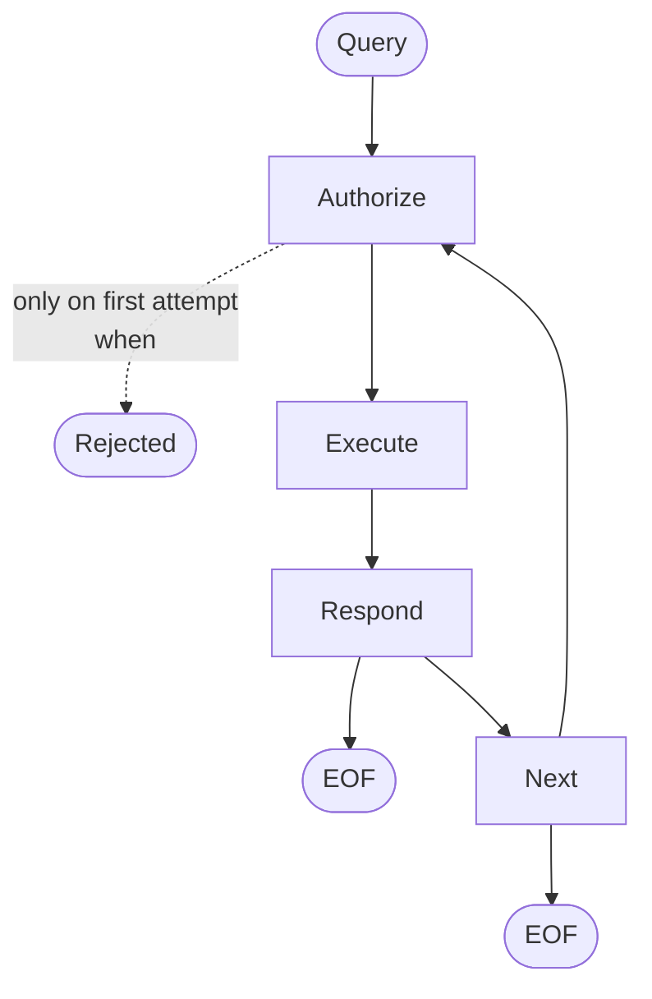
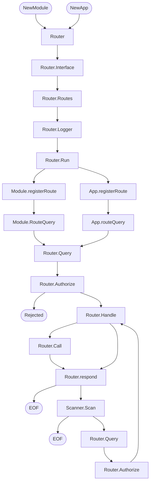

simplified flow

```mermaid
flowchart
    Query([Query]) --> Authorize -.only on first attempt \n when.-> Rejected([Rejected])
    Authorize --> Execute --> 
    Respond --> Return([EOF])
    Respond -->Next --> Return2([EOF])
    Next --> Authorize
```

exact flow

```mermaid
flowchart
    NewModule([NewModule]) --> Router
    NewApp([NewApp]) --> Router -->
    Router.Interface --> Router.Routes --> Router.Logger --> 
    Router.Run --> 
    Module.registerRoute --> Module.RouteQuery
    Router.Run -->
    App.registerRoute --> App.routeQuery
    Module.RouteQuery --> Router.Query
    App.routeQuery --> Router.Query
    Router.Query --> Router.Authorize
    Router.Authorize --> Rejected(["Rejected"])
    Router.Authorize --> Router.Handle -->
    Router.Call[Router.Call] --> Router.respond
    Router.Handle --> Router.respond --> Return(["EOF"])
    Router.respond --> Scanner.Scan --> Return2(["EOF"])
    Scanner.Scan --> Router.Query2[Router.Query] --> 
    Router.Authorize2[Router.Authorize] --> Router.Handle
```
